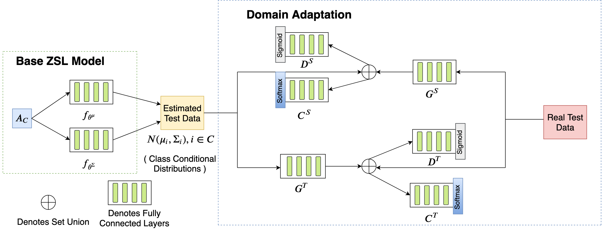

# ZSL-ADA
Code accompanying the paper [A Generative Framework for Zero Shot Learning with Adversarial Domain Adaptation](https://arxiv.org/abs/1906.03038) published in [WACV 2020](http://wacv20.wacv.net/), with the following author list: [Varun Khare*](https://vkkhare.github.io/), [Divyat Mahajan*](https://divyat09.github.io/), [Homanga Bharadhwaj](https://homangab.github.io/), [Vinay K. Verma](), and [Piyush Rai](https://homangab.github.io/)

# Brief note about the paper

This paper present a domain adaptation based generative framework for zero shot  learning. We address the problem of domain shift between the seen and unseen class distribution in Zero-Shot Learning (ZSL) and seek to minimize it by developing a generative model and training it via adversarial domain adaptation. Our approach is based on end-to-end learning of the class distributions of seen classes and unseen classes. To enable the model to learn the class distributions of unseen classes, we parameterize these class distributions in terms of the class attribute information (which is available for both seen and unseen classes). This provides a very simple way to learn the class distribution of any unseen class, given only its class attribute information, and no labeled training data. Training this model with adversarial domain adaptation provides robustness against the distribution mismatch between the data from seen and unseen classes. It also engenders a novel way for training neural net based classifiers to overcome the hubness problem in Zero-Shot learning. Through a comprehensive set of experiments, we show that our model yields superior accuracies as compared to various state-of-the-art zero shot learning models, on a variety of benchmark datasets.  

&nbsp;
&nbsp;
</br>
If you have questions/comments about the code or the paper, please contact [Varun Khare](http://home.iitk.ac.in/~varun/), [Divyat Mahajan](https://divyat09.github.io/), or [Homanga Bharadhwaj](https://homangab.github.io/)

# If you find this repo useful, please consider citing our paper

```bibtex
@inproceedings{khare2020generative,
  title={A Generative Framework for Zero Shot Learning with Adversarial Domain Adaptation},
  author={Khare, Varun and Mahajan, Divyat and Bharadhwaj, Homanga and Verma, Vinay Kumar and Rai, Piyush},
  booktitle={The IEEE Winter Conference on Applications of Computer Vision},
  pages={3101--3110},
  year={2020}
}
```
